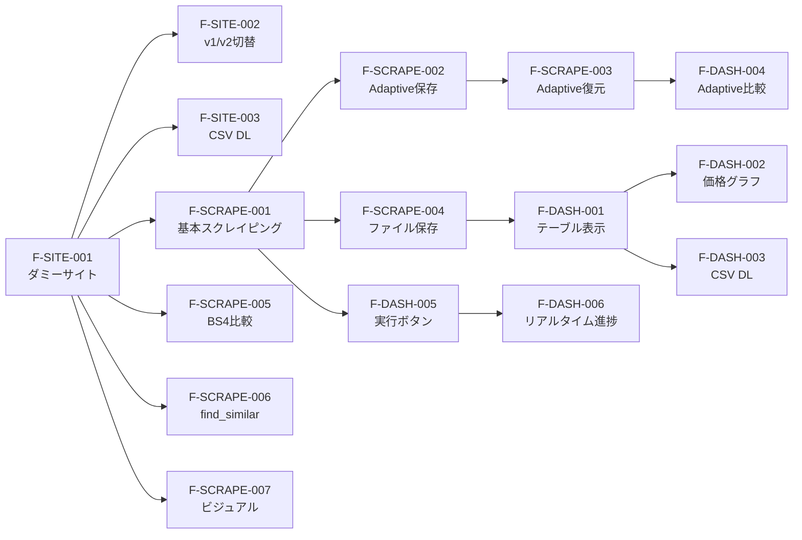

# 02. 機能一覧 — Scrapling Price Tracker

## 機能マトリクス

| 機能ID | 機能名 | 対応ファイル | 依存 | 並列可否 |
|--------|--------|-------------|------|:--------:|
| F-SITE-001 | ダミーサイト商品一覧 | `demo_site/app.py` | なし | ✅ |
| F-SITE-002 | v1/v2 UI切替 | `demo_site/app.py` | F-SITE-001 | - |
| F-SITE-003 | CSV DLエンドポイント | `demo_site/app.py` | F-SITE-001 | - |
| F-SCRAPE-001 | 基本スクレイピング | `scraper/basic.py` | F-SITE-001 | ✅ |
| F-SCRAPE-002 | Adaptive保存 | `scraper/adaptive.py` | F-SCRAPE-001 | ❌ |
| F-SCRAPE-003 | Adaptive復元 | `scraper/adaptive.py` | F-SCRAPE-002 | ❌ |
| F-SCRAPE-004 | 結果ファイル保存 | `scraper/basic.py` | F-SCRAPE-001 | - |
| F-SCRAPE-005 | BS4比較デモ | `scraper/comparison.py` | F-SITE-001 | ✅ |
| F-SCRAPE-006 | find_similar デモ | `scraper/similarity.py` | F-SITE-001 | ✅ |
| F-SCRAPE-007 | ビジュアルスクレイピング | `scraper/visual.py` | F-SITE-001 | ✅ |
| F-DASH-001 | 商品一覧テーブル | `dashboard/app.py` | F-SCRAPE-004 | ✅ |
| F-DASH-002 | 価格グラフ | `dashboard/app.py` | F-SCRAPE-004 | - |
| F-DASH-003 | CSV DL（ダッシュボード側） | `dashboard/app.py` | F-DASH-001 | - |
| F-DASH-004 | Adaptive比較ビュー | `dashboard/app.py` | F-SCRAPE-003 | ❌ |
| F-DASH-005 | スクレイピング実行ボタン | `dashboard/app.py` | F-SCRAPE-001 | - |
| F-DASH-006 | リアルタイム進捗表示 | `dashboard/app.py` | F-DASH-005 | - |

## 実装依存グラフ



## 実装グループ（順序）

| Phase | グループ | 機能ID | 所要時間目安 |
|-------|---------|--------|:----------:|
| 1 | ダミーサイト | F-SITE-001, 002, 003 | 30分 |
| 2 | スクレイパー基本 | F-SCRAPE-001, 004, 005, 006, 007 | 60分 |
| 3 | Adaptive | F-SCRAPE-002, 003 | 30分 |
| 4 | ダッシュボード | F-DASH-001〜006 | 90分 |

## 受け入れ基準

### F-SITE-002: v1/v2 UI切替
```
Given: ダミーサイトがv1で表示されている
When:  /switch にアクセスする
Then:  v2デザインに切り替わり、以下が全て変更されている
       - class名（product-card → item-tile 等）
       - タグ名（h2 → h3, div → article 等）
       - data属性名（data-id → data-product-id）
```

### F-SCRAPE-003: Adaptive復元
```
Given: v1でauto_save=Trueにより要素の指紋が保存済み
When:  v2のHTMLに対してadaptive=Trueでcss()を実行する
Then:  元のセレクタ(.product-name等)が存在しなくても
       類似度スコアにより正しい要素が返される
```

### F-DASH-004: Adaptive比較ビュー
```
Given: v1/v2両方のスクレイピング結果がある
When:  ダッシュボードの「Adaptive比較」タブを開く
Then:  BS4(0件) vs Scrapling(復元成功) の比較が表示される
```
