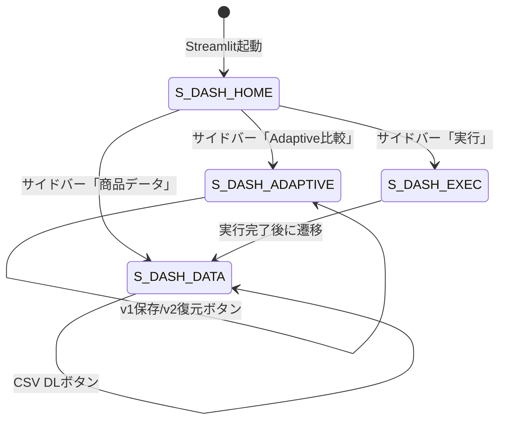

# 04. 画面設計書 — Scrapling Price Tracker

## 画面一覧

| 画面ID | 画面名 | パス | 説明 |
|--------|--------|------|------|
| S-SITE-V1 | ダミーサイト v1 | localhost:5001/ | 初期デザインの商品一覧 |
| S-SITE-V2 | ダミーサイト v2 | localhost:5001/ (切替後) | リニューアル後の商品一覧 |
| S-DASH-HOME | ダッシュボード概要 | localhost:8501 (サイドバー: 概要) | アプリ説明・構成図 |
| S-DASH-DATA | 商品データ | localhost:8501 (サイドバー: 商品データ) | テーブル+グラフ+CSV DL |
| S-DASH-ADAPTIVE | Adaptive比較 | localhost:8501 (サイドバー: Adaptive比較) | BS4 vs Scrapling 比較 |
| S-DASH-EXEC | スクレイピング実行 | localhost:8501 (サイドバー: 実行) | ワンクリック実行 |

## 画面遷移



## S-DASH-HOME: 概要ページ

```
┌─────────────────────────────────────────────────┐
│ 🕷️ Scrapling Price Tracker                      │
├─────────┬───────────────────────────────────────┤
│         │                                       │
│ 📍概要  │  ## Scrapling Price Tracker            │
│         │                                       │
│ 📊商品  │  Scraplingの主要機能をデモするアプリ    │
│ データ  │                                       │
│         │  ### アーキテクチャ                     │
│ 🔄Adapt │  [Flask] → [Scrapling] → [JSON/CSV]   │
│ ive比較 │                    → [Streamlit]       │
│         │                                       │
│ ⚡実行   │  ### 使い方                            │
│         │  1. Flask起動: python demo_site/app.py  │
│         │  2. スクレイピング実行                   │
│         │  3. ダッシュボードで確認                 │
│         │                                       │
│         │  ### Scraplingとは                      │
│         │  GitHub ★17,700+ のPython製...         │
└─────────┴───────────────────────────────────────┘
```

## S-DASH-DATA: 商品データページ

```
┌─────────────────────────────────────────────────┐
│ 🕷️ Scrapling Price Tracker                      │
├─────────┬───────────────────────────────────────┤
│         │                                       │
│ 📍概要  │  ## 📊 商品データ                      │
│         │                                       │
│ 📊商品  │  データソース: [v1結果 ▼]  [CSV DL 📥] │
│ データ  │                                       │
│  ★      │  ┌──┬──────────┬──────┬─────┬────┐   │
│ 🔄Adapt │  │# │商品名    │価格  │評価 │分類│   │
│ ive比較 │  ├──┼──────────┼──────┼─────┼────┤   │
│         │  │1 │イヤホンPro│12,800│4.5 │音響│   │
│ ⚡実行   │  │2 │ウォッチX1│29,800│4.2 │装着│   │
│         │  │3 │USBハブ   │4,980 │4.7 │周辺│   │
│         │  │..│...       │...   │... │... │   │
│         │  └──┴──────────┴──────┴─────┴────┘   │
│         │                                       │
│         │  ┌─────────────┐ ┌─────────────┐      │
│         │  │ 価格棒グラフ │ │カテゴリ円グラフ│     │
│         │  │ (px.bar)    │ │ (px.pie)    │      │
│         │  └─────────────┘ └─────────────┘      │
└─────────┴───────────────────────────────────────┘
```

## S-DASH-ADAPTIVE: Adaptive比較ページ

```
┌─────────────────────────────────────────────────┐
│ 🕷️ Scrapling Price Tracker                      │
├─────────┬───────────────────────────────────────┤
│         │                                       │
│ 📍概要  │  ## 🔄 Adaptive Scraping 比較          │
│         │                                       │
│ 📊商品  │  ### v1 → v2 の変更点                  │
│ データ  │  ┌────────┬──────────────┬─────────┐   │
│         │  │要素    │v1セレクタ    │v2セレクタ│   │
│ 🔄Adapt │  ├────────┼──────────────┼─────────┤   │
│ ive比較 │  │商品カード│div.product-card│article.item-tile│
│  ★      │  │商品名  │h2.product-name│h3.title │   │
│ ⚡実行   │  │価格    │span.product-price│div.cost│   │
│         │  └────────┴──────────────┴─────────┘   │
│         │                                       │
│         │  ### 比較結果                           │
│         │  ┌──────────┬────────┬──────────┐      │
│         │  │セレクタ  │BS4(v2) │Scrapling │      │
│         │  ├──────────┼────────┼──────────┤      │
│         │  │.product  │💥 0件  │✅ 復元   │      │
│         │  │-name     │        │          │      │
│         │  └──────────┴────────┴──────────┘      │
│         │                                       │
│         │  ┌──────┐  ┌──────┐  ← st.metric      │
│         │  │BS4   │  │Scrap │                    │
│         │  │💥 0件│  │✅ N件│                    │
│         │  └──────┘  └──────┘                    │
│         │                                       │
│         │  ▸ 復元詳細（展開可能 st.expander）     │
│         │                                       │
│         │  [📌Phase1: v1保存][🔄Phase2: v2復元][⚡フルデモ]│
│         │  ← 3つのデモ再実行ボタン               │
└─────────┴───────────────────────────────────────┘
```

## S-DASH-EXEC: スクレイピング実行ページ

```
┌─────────────────────────────────────────────────┐
│ 🕷️ Scrapling Price Tracker                      │
├─────────┬───────────────────────────────────────┤
│         │                                       │
│ 📍概要  │  ## ⚡ スクレイピング実行               │
│         │                                       │
│ 📊商品  │  対象URL: [http://localhost:5001   ]   │
│ データ  │                                       │
│         │  [🕷️基本スクレイピング][🔄Adaptiveフルデモ][👁️ビジュアル実行]│
│ 🔄Adapt │  ← 3つの実行ボタン（等幅）             │
│ ive比較 │                                       │
│         │  --- 実行中（リアルタイム表示） ---      │
│ ⚡実行   │                                       │
│  ★      │  ▼ スクレイピング実行中... (st.status)  │
│         │  │ ⏳ 商品カードを検出中...              │
│         │  │ ℹ️ v1構造を検出                      │
│         │  │ 💾 保存完了                          │
│         │                                       │
│         │  ████████░░░░░░  4/6  ← st.progress   │
│         │                                       │
│         │  ┌──┬──────────┬──────┐ ← リアルタイム │
│         │  │# │商品名    │価格  │   テーブル更新  │
│         │  ├──┼──────────┼──────┤                │
│         │  │1 │イヤホン  │12800 │                │
│         │  │2 │ウォッチ  │29800 │                │
│         │  └──┴──────────┴──────┘                │
│         │                                       │
│         │  --- 完了後 ---                        │
│         │  取得件数: 6件  平均価格: ¥13,680      │
└─────────┴───────────────────────────────────────┘
```

**ビジュアル実行時の注意:** ブラウザウィンドウが別途開き、ハイライト付きでスクレイピング過程が可視化される。

## ダミーサイト v1 デザイン

```
┌──────────────────────────────────────┐
│         TechShop                     │  ← div.header > h1
│   最新ガジェットをお手頃価格で        │
├──────────────────────────────────────┤
│ ┌──────────┐┌──────────┐┌──────────┐│
│ │オーディオ ││ウェアラブル││アクセサリ ││ ← span.product-category
│ │イヤホンPro││ウォッチX1 ││USBハブ   ││ ← h2.product-name
│ │¥12,800   ││¥29,800   ││¥4,980    ││ ← span.product-price
│ │★ 4.5     ││★ 4.2     ││★ 4.7     ││ ← div.product-rating
│ │128件     ││89件      ││256件     ││
│ └──────────┘└──────────┘└──────────┘│ ← div.product-card
│ ┌──────────┐┌──────────┐┌──────────┐│
│ │...       ││...       ││...       ││
│ └──────────┘└──────────┘└──────────┘│
├──────────────────────────────────────┤
│ [UI切替]              [v1 - Original]│
└──────────────────────────────────────┘
```

## ダミーサイト v2 デザイン

```
┌──────────────────────────────────────┐
│ TechShop                      🔍検索 │ ← nav.site-nav > span.logo
├──────────────────────────────────────┤
│ ┌──────────┐┌──────────┐┌──────────┐│
│ │[オーディオ]│[ウェアラブル]│[アクセサリ]│ ← span.tag
│ │イヤホンPro││ウォッチX1 ││USBハブ   ││ ← h3.title
│ │¥12,800   ││¥29,800   ││¥4,980    ││ ← div.cost
│ │★★★★☆ 4.5││★★★★☆ 4.2││★★★★★ 4.7││ ← div.stars
│ │128件     ││89件      ││256件     ││ ← span.review-count
│ └──────────┘└──────────┘└──────────┘│ ← article.item-tile
│                     (ダークテーマ)    │
├──────────────────────────────────────┤
│ [UI切替]          [v2 - Redesigned 🎨]│
└──────────────────────────────────────┘
```
